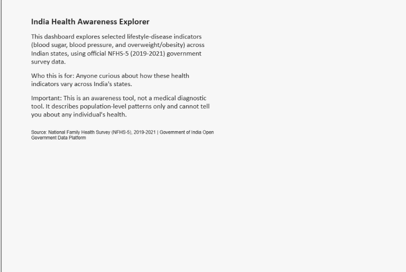
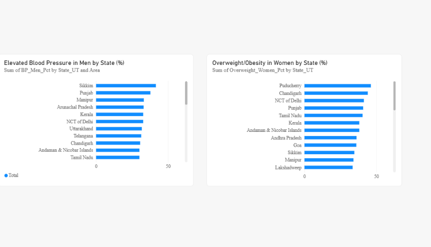
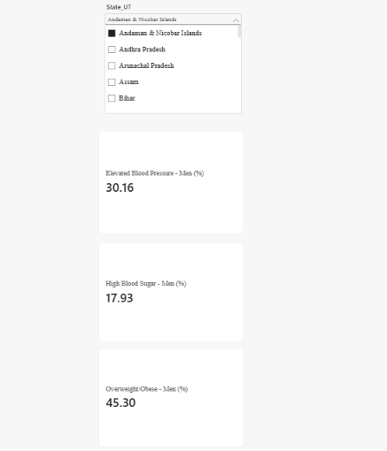
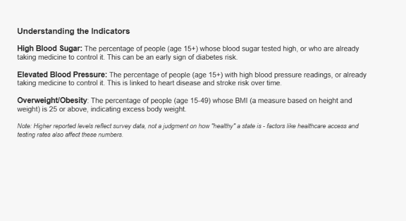
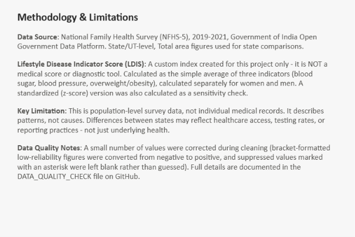

# India Health Awareness Explorer

An awareness-focused data analytics project exploring lifestyle-disease indicators — high blood sugar, elevated blood pressure, and overweight/obesity — across Indian states and union territories, using official government survey data.

## Why This Matters

Lifestyle diseases are a growing public health concern in India, and levels vary widely across states. This project turns raw government survey data into an understandable, state-by-state comparison tool that anyone — not just researchers — can explore and learn from.

## Dataset & Source

- **Source:** National Family Health Survey (NFHS-5), 2019–2021 — Government of India Open Government Data (OGD) Platform
- **Level:** State/UT (Urban, Rural, and Total figures for 36 states/UTs plus an India-level total)
- **Access:** [data.gov.in — NFHS-5 State/UT Factsheets](https://data.gov.in/resource/all-india-and-stateut-wise-factsheets-national-family-health-survey-nfhs-5-2019-2021)

## Indicators Selected

Indicators are reported **separately for women and men** (not averaged), for analytical clarity:

| Indicator | Description |
|---|---|
| High Blood Sugar | % of people (age 15+) with high/very high blood sugar (>140 mg/dl) or on medication for it |
| Elevated Blood Pressure | % of people (age 15+) with elevated BP (≥140/90 mmHg) or on medication for it |
| Overweight/Obesity | % of people (age 15–49) with BMI ≥25.0 kg/m² |

## Data Cleaning

- Reduced the original 136-column source file down to the 6 indicator columns needed, plus State/UT and Area identifiers
- **Fixed a data quality bug:** the source file uses brackets like `(x.x)` to flag low-reliability, small-sample figures — during file conversion these were misread as negative numbers. All affected values were corrected (converted to positive) and flagged in a `Data_Quality_Flag` column
- This bug was initially fixed only for the Blood Sugar and Blood Pressure columns; a second pass — triggered by an unusual result in Python's `df.describe()` — caught the same issue in the Overweight columns for two more state/area rows. All affected files were rebuilt and the fix is documented in the data quality log
- Suppressed values (marked `*` in the source, meaning fewer than 25 survey cases) were left as true missing values — never guessed or filled with zero

Full details: see the `DATA_QUALITY_CHECK` sheet inside [`data/CLEAN_DATA.xlsx`](data/CLEAN_DATA.xlsx).

## Analysis Workflow

1. **Excel** — cleaning, data dictionary, exploratory analysis (national averages, highest/lowest states, spread) — see [`docs/EXCEL_ANALYSIS.xlsx`](docs/EXCEL_ANALYSIS.xlsx)
2. **SQL** (via Google Colab / SQLite) — structured queries: rankings, above-average filtering, urban/rural comparison, categorization — see [`SQL/analysis.sql`](SQL/analysis.sql)
3. **Python** (pandas, matplotlib, via Google Colab) — data validation and 3 charts with written explanations — see [`python/01_nfhs5_health_awareness_analysis.ipynb`](python/01_nfhs5_health_awareness_analysis.ipynb)
4. **Power BI** — 5-page interactive dashboard (see below)

## Lifestyle Disease Indicator Score (LDIS)

A custom index created for this project only — **it is not a medical score or diagnostic tool.**

- **Baseline:** simple average of the three indicator percentages, calculated separately for women and men
- **Sensitivity check:** a standardized (z-score) version was also calculated, to check whether the ranking holds up under a different scoring method
- **Result:** Kerala ranks #1 (highest LDIS) for both women and men, under both scoring methods — a stable, defensible finding

Full methodology: see [`docs/LDIS_ANALYSIS.xlsx`](docs/LDIS_ANALYSIS.xlsx) and the dashboard's Methodology page below.

## Dashboard

Built in Power BI Desktop. Since Power BI Service (online publishing) requires a work/school email account, this dashboard is shared via screenshots below rather than a live link.

### 1. Start Here
Project intro, purpose, and disclaimer.



### 2. Explore India
State-by-state comparison charts for blood pressure and overweight/obesity.



### 3. Explore a State
Interactive dropdown to view any state's indicator values.



### 4. Understand the Indicators
Plain-language explanations of each health measure.



### 5. Methodology
Data source, LDIS explanation, and limitations.



## Key Findings

- **Kerala** has the highest reported high-blood-sugar levels among both women and men
- **Sikkim** has the highest reported elevated blood pressure among both sexes
- **Meghalaya** has the highest reported overweight/obesity levels among both sexes
- Men report higher percentages than women across almost every indicator
- There is wide variation between states — e.g., blood pressure in men ranges from roughly 14% to 43% depending on the state

## Limitations & Responsible Use

- This is **population-level survey data**, not individual medical records — it cannot diagnose or predict any individual's health
- The project describes **patterns**, not **causes** — a higher reported level in a state does not mean that state is "unhealthier;" it may reflect differences in healthcare access, testing rates, or reporting practices
- The LDIS is a custom analytical index created for this project, not a medically validated score
- This dashboard should never be used to rank, judge, or diagnose individuals or states

## Tools Used

Excel, Google Colab (SQL + Python), Power BI Desktop, GitHub

## How to Reproduce

1. Download the source file from the [data.gov.in link above](https://data.gov.in/resource/all-india-and-stateut-wise-factsheets-national-family-health-survey-nfhs-5-2019-2021)
2. Follow the cleaning steps documented in [`data/CLEAN_DATA.xlsx`](data/CLEAN_DATA.xlsx) (Data_Quality_Check sheet)
3. Run the queries in [`SQL/analysis.sql`](SQL/analysis.sql) against the cleaned CSV
4. Run [`python/01_nfhs5_health_awareness_analysis.ipynb`](python/01_nfhs5_health_awareness_analysis.ipynb) in Google Colab
5. Open Power BI Desktop to explore/rebuild the dashboard (see screenshots above)

## Repository Structure

```
india-health-awareness-explorer/
├── README.md
├── data/
│   └── CLEAN_DATA.xlsx
├── docs/
│   ├── DATA_DICTIONARY.xlsx
│   ├── EXCEL_ANALYSIS.xlsx
│   └── LDIS_ANALYSIS.xlsx
├── SQL/
│   └── analysis.sql
├── python/
│   └── 01_nfhs5_health_awareness_analysis.ipynb
└── dashboard/
    ├── 01_start_here.png
    ├── 02_explore_india.png
    ├── 03_explore_a_state.png
    ├── 04_understand_indicators.png
    └── 05_methodology.png
```

---

*This project was built as a learning portfolio piece, combining Excel, SQL, Python, and Power BI skills using real government open data.*
